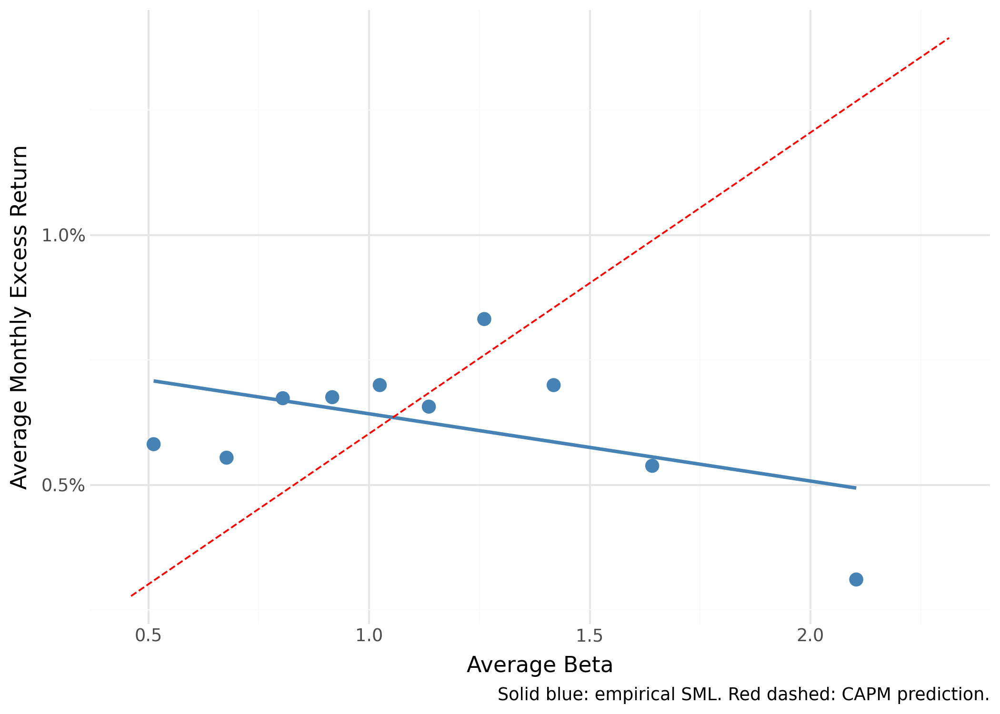
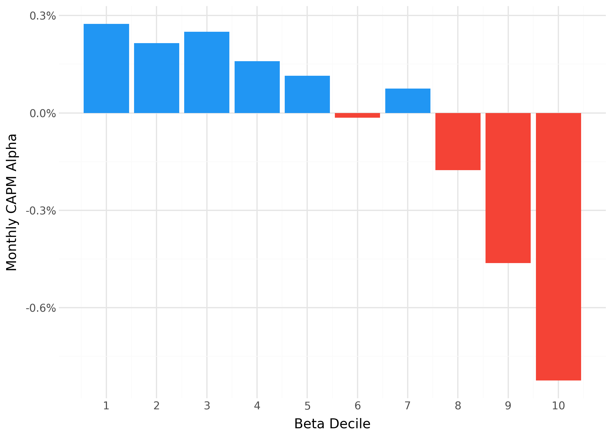
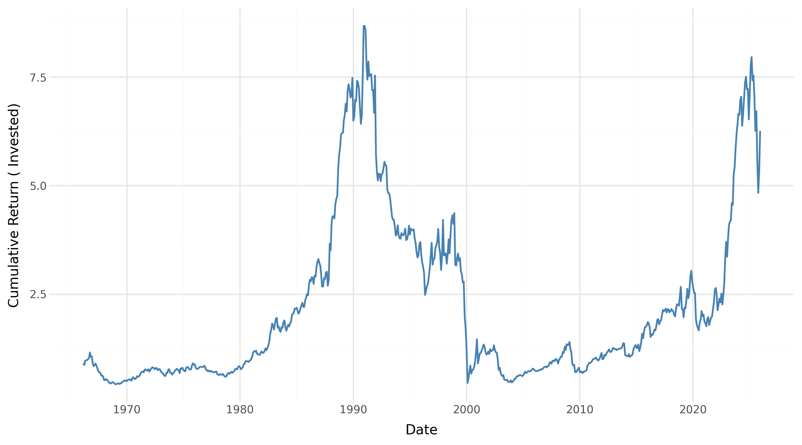

# Agenda {.section-slide background="linear-gradient(135deg, #A31D20 0%, #6e1215 100%)"}

## Overview

<ul class="agenda-list">
  <li>Motivation & Research Question</li>
  <li>Theoretical Framework — CAPM & Leverage Constraints</li>
  <li>Propositions 1 & 2 (Frazzini & Pedersen, 2014)</li>
  <li>Data & Methodology — incl. Transaction Cost Construction</li>
  <li>Results (So Far) — Proposition 1: The Security Market Line</li>
  <li>Results — Proposition 2: BAB Factor Performance</li>
  <li>Results — Transaction Costs</li>
  <li>Discussion & Conclusion</li>
</ul>

# Motivation {.section-slide background="linear-gradient(135deg, #A31D20 0%, #6e1215 100%)"}

## The Beta Anomaly

::: {.columns-custom}
::: {}
**CAPM Prediction**

The Capital Asset Pricing Model predicts a *positive, linear* relationship between beta and expected return:

$$R_i - r_f = \alpha + \beta(R_m - r_f) + \varepsilon$$

- Higher $\beta$ → higher expected return
- All assets lie on the **Security Market Line (SML)**
- $\alpha = 0$ for all assets in equilibrium

:::
::: {}
**The Empirical Reality**

::: {.highlight-box}
High-beta stocks tend to have **lower** alphas than their CAPM-predicted values — contradicting the model.
:::

This is the **beta anomaly**: the empirical SML is significantly *flatter* than CAPM predicts.

Evidence: @blackjensenscholes1972, @famafrench1992, @famafrench2004
:::
:::

## Research Question

::: {.finding-box}
**We test two propositions from @frazzinipedersen2014:**

1. Is there a negative relationship between beta and alpha? *(Proposition 1)*
2. Does a long–short BAB strategy exploiting this anomaly generate positive returns? *(Proposition 2)*
:::

**Sample:** US equities, January 1963 – December 2025

**Extension:** We introduce **transaction costs** to assess whether the strategy survives real-world trading frictions.

# Theoretical Framework {.section-slide background="linear-gradient(135deg, #A31D20 0%, #6e1215 100%)"}

## Why Does the Beta Anomaly Exist?

::: {.columns-custom}
::: {}
**Leverage Constraints**

When investors *cannot borrow freely*, they compensate by over-buying high-beta risky assets.

- Excess demand → **lower expected returns** for high-beta assets
- The SML becomes **flatter** than CAPM predicts
- High-beta assets become *overpriced*; low-beta assets *underpriced*

:::
::: {}
**Equilibrium Expected Return**

@frazzinipedersen2014 show:

$$E_t(r^s_{t+1}) = r^f + \psi_t + \beta^s_t \lambda_t$$

where $\psi_t$ measures the **tightness of funding constraints** and $\lambda_t$ is the risk premium adjusted for these constraints.

A security's CAPM alpha then equals:

$$\alpha^s_t = \psi_t(1 - \beta^s_t)$$

:::
:::

## Proposition 1: High Beta is Low Alpha

$$\alpha^s_t = \psi_t\,(1 - \beta^s_t)$$

::: {.columns-custom}
::: {}

**Implications:**

- $\alpha^s$ is *decreasing* in $\beta^s$
- When $\beta^s > 1$: $\alpha < 0$ → **high-beta stocks are overpriced**
- When $\beta^s < 1$: $\alpha > 0$ → **low-beta stocks are underpriced**
- The Sharpe ratio is highest for $\beta < 1$

:::
::: {}
::: {.highlight-box}
**Testable prediction:** Running Fama–MacBeth cross-sectional regressions of excess returns on beta should yield a slope that is *significantly below* the average market excess return, ideally indistinguishable from zero.
:::
:::
:::

## Proposition 2: The BAB Factor

Let $w^L_t$ be weights on low-beta stocks (return $r^L$) and $w^H_t$ on high-beta stocks (return $r^H$):

$$r^{BAB}_{t+1} = \frac{1}{\beta^L_t}(r^L_{t+1} - r^f) - \frac{1}{\beta^H_t}(r^H_{t+1} - r^f)$$

::: {.columns-60-40}
::: {}

**Strategy mechanics:**

- **Long** leg: leveraged low-beta portfolio (scaled to $\beta = 1$)
- **Short** leg: de-leveraged high-beta portfolio (scaled to $\beta = 1$)
- The combined portfolio is **market-neutral** ($\beta = 0$)

:::
::: {}
::: {.result-box}
**Expected return:**
$$E_t(r^{BAB}) = \frac{\beta^H_t - \beta^L_t}{\beta^L_t \beta^H_t}\,\psi_t \geq 0$$

Increasing in the beta spread and funding constraint tightness $\psi_t$.
:::
:::
:::

# Data & Methodology {.section-slide background="linear-gradient(135deg, #A31D20 0%, #6e1215 100%)"}

## Data

| Dataset | Frequency | Content | Purpose |
|---|---|---|---|
| CRSP stock data | Monthly | Excess returns, market cap | BAB portfolio & factor returns |
| CRSP stock data | Daily | Excess returns, bid-ask | Volatility (β); transaction costs |
| Fama-French factors | Monthly & Daily | Risk-free rate, market excess return | Excess returns; correlation (β) |

**Sample:** January 1963 – December 2025 · NYSE, AMEX, NASDAQ

::: {.caption}
Data accessed via the `tidyfinance` Python package through WRDS; Fama-French data from Kenneth French Data Library.
:::

## Beta Estimation

Following @frazzinipedersen2014, beta is estimated in **two components**:

::: {.columns-custom}
::: {}

**Volatility** (daily returns, 1-year rolling):
$$\hat{\sigma}_i = \text{std}(\text{daily } r_i), \quad \hat{\sigma}_m = \text{std}(\text{daily } r_m)$$

**Correlation** (monthly returns, 5-year rolling):
$$\hat{\rho}_{im} = \text{corr}(\text{monthly } r_i,\; r_m)$$

**Combined estimate:**
$$\hat{\beta}_i = \hat{\rho}_{im} \cdot \frac{\hat{\sigma}_i}{\hat{\sigma}_m}$$

:::
::: {}
::: {.highlight-box}
**Vasicek shrinkage** — shrink each time-series beta toward the cross-sectional mean:

$$\hat{\beta}^{shrunk}_i = 0.6\;\hat{\beta}_i + 0.4 \times 1$$

This reduces estimation error for stocks with short histories.
:::
:::
:::

## BAB Factor Construction

::: {.columns-custom}
::: {}

**Each month:**

1. Sort stocks by $\hat{\beta}^{shrunk}$ into **above-** and **below-median** halves
2. Assign **rank weights** within each half — more extreme betas receive more weight (lowest-beta stocks dominate the long leg; highest-beta stocks dominate the short leg)
3. Compute leg betas $\hat{\beta}^L$, $\hat{\beta}^H$
4. Scale both legs to unit beta and compute BAB return

:::
::: {}
**Testing Proposition 1 — Fama-MacBeth:**

Each month estimate:
$$r^{excess}_{i,t} = \gamma_0 + \gamma_1 \hat{\beta}_{i,t-1} + \varepsilon_{i,t}$$

Time-series average $\bar{\gamma}_1$ should be **near zero** (anomaly present) vs. CAPM prediction of $\bar{\gamma}_1 \approx \bar{r}^{excess}_m$.

Also compute CAPM $\alpha$ for each **beta-sorted decile portfolio**.

:::
:::

## Transaction Cost Methodology

::: {.columns-custom}
::: {}

**Step 1 — Estimate the cost per trade**

From CRSP daily data, compute each stock's proportional **bid-ask half-spread**:

$$\text{half-spread}_{i,t} = \frac{\text{ask}_{i,t} - \text{bid}_{i,t}}{2 \times \text{mid}_{i,t}}$$

The **round-trip cost** for a full buy-then-sell is:

$$c_{i,t} = 2 \times \text{half-spread}_{i,t}$$

:::
::: {}

**Step 2 — Apply costs to portfolio turnover**

Each month, the BAB strategy rebalances both legs. The TC drag on leg $k \in \{L, H\}$ is:

$$TC^k_t = \sum_i \left| \Delta w^k_{i,t} \right| \cdot c_{i,t}$$

where $\Delta w^k_{i,t}$ is the weight change for stock $i$.

::: {.highlight-box}
**Net BAB return** = Gross BAB return − TC drag (long leg) − TC drag (short leg)

This assumes **full monthly rebalancing** — an upper bound on true turnover.
:::

:::
:::

# Results (So Far) {.section-slide background="linear-gradient(135deg, #A31D20 0%, #6e1215 100%)"}

## Proposition 1: Fama-MacBeth Results

::: {.columns-custom}
::: {}

| | Mean (%/month) | *t*-statistic |
|---|---:|---:|
| Intercept | **0.79** | 5.89 |
| Beta | 0.14 | 0.75 |

::: {.caption}
Time-series averages of monthly cross-sectional Fama-MacBeth coefficients. *t*-stats from time-series standard error.
:::

:::
::: {}

**Interpretation:**

- Intercept of 0.79%/month is highly significant
- Beta slope 0.14%/month is *indistinguishable from zero* (*t* = 0.75)
- CAPM predicts slope ≈ average market excess return (≫ 0.14%)

::: {.result-box}
**→ Supports Proposition 1:** The empirical compensation for bearing systematic risk is far below what CAPM predicts.
:::

:::
:::

## Proposition 1: Security Market Line

::: {.columns-custom}
::: {}

**Beta-decile SML vs. CAPM prediction**

- Empirical SML (blue) is significantly *flatter* than the CAPM line (red dashed)
- The extreme high-beta decile (avg $\hat{\beta} \approx 2.1$) earns clearly *below* its CAPM-predicted return

::: {.highlight-box}
**Apparent tension:** The FMB slope (0.14%) is slightly *positive*, yet the decile SML appears to slope *downward*. Both are consistent with the anomaly — Fama-MacBeth weights all stocks equally so moderate-beta stocks dominate the slope, while the decile plot gives the extreme high-beta group disproportionate leverage on the fitted line.
:::

:::
::: {}
{width=100%}
:::
:::

## Proposition 1: Decile Alpha Results

::: {.columns-custom}
::: {}
**Broadly declining alpha across deciles:**

- **Decile 1** (avg $\beta = 0.49$): $\alpha = +0.27\%$/month (significant)
- **Decile 2**: $\alpha = +0.22\%$/month, $t > 2.4$
- **Decile 3**: $\alpha = +0.25\%$/month, $t > 3.2$
- **Decile 6** (avg $\beta \approx 1.0$): $\alpha \approx 0\%$
- **Decile 10** (avg $\beta = 2.10$): $\alpha = -0.82\%$/month, $t = -3.16$

::: {.result-box}
Alpha spread (decile 1 → 10): approximately **−1.1 pp/month** — the pattern is monotone and statistically significant across multiple deciles, not just at the extremes.
:::
:::
::: {}
{width=100%}
:::
:::

## Proposition 2: BAB Factor Performance

| Metric | BAB Factor |
|---|---:|
| Ann. Mean Return | **8.85%** |
| Ann. Std. Deviation | 11.26% |
| Sharpe Ratio | **0.79** |
| *t*-statistic | **6.08** |

::: {.caption}
Performance statistics for the BAB factor following @frazzinipedersen2014. Mean and SD annualised (×12, ×√12). Sample: US equities, January 1963 – December 2025.
:::

::: {.result-box}
**Sharpe ratio of 0.79** with *t*-stat of **6.08** — strongly statistically significant positive returns. **→ Supports Proposition 2.**
:::

## BAB Cumulative Return

::: {.columns-60-40}
::: {}
{width=100%}
:::
::: {}
**Key observations:**

- Strong growth through the **1990s**
- Partial retrace during **2000–2010**
- Recovery and further compounding toward **2025**

The strategy generates meaningful returns over the full sample, with considerable sub-period variation.
:::
:::

## Transaction Costs

| | Gross BAB | Net BAB |
|---|---:|---:|
| Ann. Mean Return | **9.18%** | **−51.12%** |
| *t*-statistic | 3.94 | −13.98 |
| Avg. Annual TC Drag | | **60.30 pp** |

::: {.caption}
TC subsample: January 1993 – December 2025 (start date driven by CRSP bid-ask spread data availability). Round-trip costs from CRSP daily bid-ask half-spreads, assuming full monthly rebalancing.
:::

::: {.highlight-box}
**The TC drag of 60.30 pp/year far exceeds the gross return of 8.85%.** Under full monthly rebalancing the strategy is entirely non-viable after realistic trading frictions.
:::

# Discussion {.section-slide background="linear-gradient(135deg, #A31D20 0%, #6e1215 100%)"}

## Proposition 1 in Context

::: {.columns-custom}
::: {}
**Consistent with prior literature:**

- @blackjensenscholes1972 — first systematic evidence of flat SML (NYSE, 1926–1966)
- @famafrench1992 — beta loses explanatory power once size & book-to-market included
- @famafrench2004 — CAPM core prediction contradicted by data

Our results **replicate** the core finding of @frazzinipedersen2014 on an extended US sample (1963–2025).

:::
::: {}
::: {.finding-box}
**Our estimates:**

- FMB beta slope: 0.14%/month (*t* = 0.75) — near zero
- Alpha spread (decile 1 to 10): ≈ −1.1 pp/month
- Both economically large and statistically significant at the distribution extremes

Extends @frazzinipedersen2014's sample period by ~13 years with consistent conclusions.
:::
:::
:::

## Proposition 2 in Context

::: {.columns-custom}
::: {}

**No post-publication decay:**

- Gross BAB in TC subsample (1993–2025): **9.18%** (*t* = 3.94)
- Full sample (1963–2025): **8.85%** (*t* = 6.08)
- The anomaly appears **persistent** into the more recent period

@bakerbradleywurgler2011 predict decay as capital flows to exploit the anomaly — our data do **not** strongly support this narrative.

:::
::: {}
**Transaction costs are overstated:**

Our TC estimate is an *extreme upper bound*. @frazziniisraelmoskowitz2015 use proprietary execution data and find effective implementation costs of **tens of basis points** per year — the strategy remains profitable after realistic costs.

::: {.highlight-box}
Our TC result is best read as a **sensitivity analysis**, not a verdict on strategy viability.
:::
:::
:::

## Limitations

::: {.columns-custom}
::: {}

**Sample scope:**

- US equities only
- @frazzinipedersen2014 document BAB profitability in **20 international markets** and multiple asset classes

**TC methodology:**

- CRSP quoted spreads are wide pre-2001 (⅛ dollar tick)
- Full monthly rebalancing → upper bound on turnover
- Effective spreads ≈ ½ of quoted spreads for large institutions

:::
::: {}

**Construction & bias:**

- High-beta stocks more likely to be small, volatile, distressed
- Delisting return corrections could affect top-decile alpha estimates

**Sub-period analysis:**

- No split by pre/post-decimalization (2001)
- Growing institutional awareness of BAB post-2014

:::
:::

# Conclusion {.section-slide background="linear-gradient(135deg, #A31D20 0%, #6e1215 100%)"}

## Key Findings

::: {.columns-custom}
::: {}
**Proposition 1 ✓**

::: {.result-box}
Strong evidence of a **negative beta–alpha relationship** in US equities (1963–2025).

FMB beta slope: 0.14%/month (*t* = 0.75) — far below the CAPM prediction.

Alpha spread across deciles: ≈ −1.1 pp/month.
:::

**Proposition 2 ✓**

::: {.result-box}
BAB factor earns **8.85% annualised** (SR = 0.79, *t* = 6.08) — strongly supporting positive expected returns from the strategy.
:::
:::
::: {}
**Transaction Costs ⚠**

::: {.highlight-box}
Under full monthly rebalancing with CRSP quoted spreads, TC drag of **60.30 pp/year** renders the net BAB return **−51.12%**.

This is an *upper bound* — realistic implementation costs would be substantially lower [@frazziniisraelmoskowitz2015].
:::

**Future Research**

- International replication
- Effective spread estimates & post-decimalization costs
- Sub-period analysis (pre/post 2001)
- Delisting return corrections

:::
:::

---

## {.center background="linear-gradient(135deg, #1a1a2e 0%, #0f3460 60%, #A31D20 100%)"}

::: {style="text-align: center; padding: 3rem;"}

<h1 style="font-size: 2.8em; color: white; border: none; margin-bottom: 0.5rem;">Questions?</h1>

We welcome comments and discussion

**Tobias Dines Schlünssen** · GFS189 
**Conrad Frederik Kromann** · RTL959  
Department of Economics · University of Copenhagen 
Seminar: Asset Prices and Financial Markets · June 2026

:::

## References {.smaller}

::: {#refs}
:::
